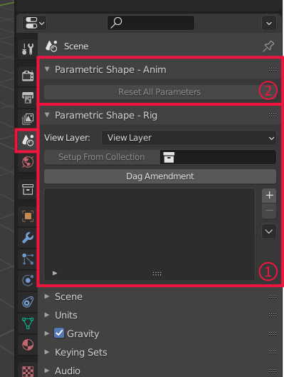

DAG Amendment for Inverse Control of Parametric Shapes
======================================================


This repository is the official Blender implementation of the paper "[*DAG Amendment for Inverse Control of Parametric Shapes*](https://perso.telecom-paristech.fr/boubek/papers/DAG_Amendment/)" by Élie Michel and Tamy Boubekeur, published in Transactions on Graphics (Siggraph 2021).

```
@article{MB:2021:DAGA, 
  title = "DAG Amendment for Inverse Control of Parametric Shapes", 
  author = "Elie Michel and Tamy Boubekeur", 
  year = "2021", 
  journal = "ACM Transactions on Graphics",
  number = "4",
  volume = "40",
  pages  = "173:1--173:14",
}
```

[](https://perso.telecom-paristech.fr/boubek/papers/DAG_Amendment/)

Usage
-----

**A.** Download [the latest release](https://github.com/eliemichel/DagAmendment/releases/latest) zip file and install it like any other Blender add-on (in `Edit > Preferences > Add-ons > Install`)

**B.** You should see two new panels in scene properties. The "*Parametric Shape - Rig*" panel (1) is where one defines the list of public hyper-parameters of the scene and the "*Parametric Shape - Anim*" panel (2) that exposes all hyper-parameters once they are defined.



**C.** We first use the *Rig* panel. Let's add a few hyper-parameters using the "+" button. Select in the list (1) an hyper-parameter to access to its settings bellow. An hyper-parameter drives a given component of an object's property, so for each of them one must define the object (2), the property (3) -- that is typically location, rotation or scale but can be any other property accessible from the Python API -- and the component (4), either 0, 1, 2 or 3 for X, Y, Z or W respectively.


These essential settings can be set directly from the hyper-parameter list for quicker access, but there are also extra settings, namely the boundaries, the default value, and the display name (automatically filled in using the object's name and target property/index by default).

**D.** Make sure your scene uses only supported modifiers, then click on **Dag Amendment**. This will insert modifiers in the scene, with name starting by `_AMENDMENT_`.


**E.** In Object mode (1), enable the "SmartGrab" tool (2). This is the brush that enables one to manipulate the scene in a way that will only affect hyper-parameters. Setting are displayed in (3) upon activation of the tool.


**F.** (optional) Tune the settings. The brush radius can be modified using Ctrl + Mouse Left, or the F key. Other settings are accessible in the upper bar. The two drop down menus are used to chose the solver (1) and the jacobian filtering algorithm (2), and depending on your choice they might have dedicated settings in (1b) et (2b) respectively. Then come settings related to the sampling and finite differences (3) and to display options (4). Default values are the one used in the paper.


Advanced Usage
--------------

**Drivers** Hyper-parameter targets are simple object properties, like an object's position, but if you want to drive properties from other entities, like a parameter of a modifier for instance, you can use [Blender's drivers](https://docs.blender.org/manual/en/latest/animation/drivers/index.html) to link the driven object (typically an empty) to the actual target.

**Setup From Collection** If you organized your scene such that a collection groups all the objects driven by hyper-parameters and that you locked all transform channels that must not be changed, then instead of manually adding the hyper-parameters one by one you may simply use the Setup From Collection button:


**View Layer** The SmartGrab brush can use a different view layer than the one you are visualizing. Points at which jacobians are measured are sampled using the view layer stated at the beginning of the *Rig* panel. Typically, use this if you want to see in wireframe the operands of some boolean operation but want the brush to ignore these.

Supported modifiers
-------------------

As a general rule of thumb, we support the modifiers that are able to transmit UV coordinates from input to output without introducing overlap, or if they introduce overlap with the possibility to disambiguate it like for instance the array modifier enables one to offset UVs for each instance.

**A note about Geometry Nodes** Geometry Nodes would be a very natural target for our method, but they did not exist in the main branch of Blender until a few months ago, so our prototype was developed without them. As a consequence, they are not supported yet by this add-on; we stuck to modifiers.

Building
--------

**NB** *If you just want to use the add-on, you do not need to build it yourself, you may simply download [the latest release](releases/latest).*

Steps 1 and 2 can be performed by simply running:

```
# on linux: apt install build-essential cmake python3.10-dev
python make_releases.py
```

1. Build Accel

```
cd Accel
mkdir build
cd build
cmake .. -DPYTHON_EXECUTABLE="C:\Python310\python.exe"
cmake --build . --config Release
cmake --install .
```

The install command simply copies the pyd file that results from building (e.g. `Accel.cp310-win_amd64.pyd`) to `DagAmendment`.

**NB:** For Blender <= 2.92, the python version must be 3.7 (the filename must contain `cp37`). From 2.93 to 3.0 use Python 3.9 (`cp39`) and from 3.1 on, it must be Python 3.10 (`cp310`).
If it is not the case, you must either set your `PATH` so that `where python` or `which python` points to the relevant version, or use `-DPYTHON_EXECUTABLE` as in the example above. This requires to have the relevant version of Python installed independently of Blender's embedded version (because the latter does not include libraries to link against).

2. Create zip from `DagAmendment/` and copy it to the `releases` directory (gitignore'd). This zip file is an add-on that can be installed in Blender.

3. In Blender, go to `Edit > Preferences`, Add-ons tab, "Install...", browse to the `release` directory created by the script above and install DiffParam and DepsgraphNodes.

Walkthrough
-----------

### Main entry points

The four main sections of the code that relates to the paper are:

 - **DAG Amendment**: Located in `dag_amendment_operators.py`, it inserts new nodes (in practice new *modifiers*) in the scene based on the analysis of the dependency graph generated using the `DepsgraphNodes/` submodule.

 - **Jacobian Filtering**: Located in `JFilters/NegativeJFilter.py` for the one described in the paper, but other alternative jacobian filtering algorithm are available (at least the naive `AverageJFilter.py`, for comparison). The JFilter takes the list of sample points and their gradients (through an instance of the `SamplePoints` class) and builds a single jacobian, for the solver to use.

 - **Solver**: Located in `Solvers/StandardSolver.py`, with an option to use active sets or not, the solver uses the jacobian returned by the JFilter and the user stroke to decide on an update of the hyper-parameters.

 - **The main interaction loop**: Located in `smartgrab_operators.py`, this operator is called when the "SmartGrab tool" is enabled to handle key/mouse events and orchestrate the calls to the jacobian filtering and solver.

### File layout

The root of the add-on is the `DagAmendment` directory, which contains only Python code. A small module is accelerated using C++ and put aside in the `Accel` directory. Once built, this module is a `.pyd` file that must be copied inside of `DagAmendment`.

As most Blender add-ons do, `DagAmendment` defines:

 - properties: extra fields attached to scenes and objects, and save into .blend files. These are defined by all files ending with `...properties.py`. Hyper-parameters for instance are properties we attach to a scene.
 - operators: actions that can be called from the UI or from other scripts, that can change properties and call other operators. They are defined in all files ending with `...operators.py`.
 - panels: the extra sections that appear in the scene properties (see usage instructions above)
 - overlays: callbacks drawing on top of the 3D viewport:
 - tools: a mapping from key/mouse event bindings to operators that is used only when the tool is activated (in the left-hand side of the 3D viewport). For instance, the "SmartGrab" tool that we define tells that when it is activated, a mouse click event must trigger the operator defined in `smartgrab_operators.py`.
 - preferences: global settings exposed in the add-ons section of `Edit > User preferences`.
 - handlers: callbacks executed by Blender at events such as file loaded, scene changed etc. Used here mostly to ensure that hyper-parameter boundaries are respected.

Then, files starting with a capital letter only define a class whose name is the same as the file. Most of them are abstraction meant to make our core implementation less tied to Blender. `ParametricShape` wraps around a scene to only expose methods we need for the interaction loop and `Brush`, `Projector`, `Ray`, `ViewportState` and `Stroke` are used by solvers instead of calling Blender specific equivalent. `SamplePoints` holds the list of points that are sampled within the brush, and measures the jacobians at each of these points.

`uv_coparam` holds the function used to convert *co-parameters*, which identify points independently of the value of the hyper-parameters, into Tuv *parameters* which quickly identify a point using a triangle index and barycentric coordinates but is valid for the current value of the hyper-parameters only. This is the part that uses `Accel` to quickly iterate the geometry.

`blender_imgui` is used only if you manually install the `imgui` module, to draw colored sliders in the viewport.

Other files are either self explanatory or of minor importance. Files ending with `...utils.py` are unorganized lists of utility functions.

The directory `DepsgraphNodes/` is an embedded add-on that introduces a new node panel where the relations from the scene (parenting, drivers, pointers to other objects in modifiers, etc.) are represented as nodes. The node tree is built by analyzing the scene. This is used because Blender's API does not natively provides a consistent graph-like interface to access this, while our DAG Amendment needs so for a clear implementation.

The directories `JFilters/` and `Solvers/` contain class files defining variants of jacobian filter and solvers respectively. When using the SmartGrab tool, the user can chose in drop down menus which of these to use. To create new alternatives, simply copy one of the existing files and change its content, then the files `jfilter_registry.py` and `solver_registry.py` will automatically find them and show them in the UI.


Troubleshooting
---------------

If the estimation of jacobians seems messy:

 - Check that you are using only supported modifiers
 - Try adding a triangulate modifier on the object that causes trouble
 - Tune the finite difference step

**Before reporting an issue** Please have a look at the system console (`Window > Toggle System Console`) for error messages. When [reporting an issue](issues/new), you must attach the full content of this console.

License
-------

Being a Blender add-on, this code is distributed as a whole under the terms of the GPLv3 license. In details, files that use the `bpy` module (Blender Python) must be GPL, other files use the more permissive MIT license.

```
Copyright (c) 2020-2022 - Télécom Paris (Élie Michel)

This program is free software: you can redistribute it and/or modify
it under the terms of the GNU General Public License as published by
the Free Software Foundation, either version 3 of the License, or
(at your option) any later version.

This program is distributed in the hope that it will be useful,
but WITHOUT ANY WARRANTY; without even the implied warranty of
MERCHANTABILITY or FITNESS FOR A PARTICULAR PURPOSE.  See the
GNU General Public License for more details.

You should have received a copy of the GNU General Public License
along with this program.  If not, see <https://www.gnu.org/licenses/>.
```
